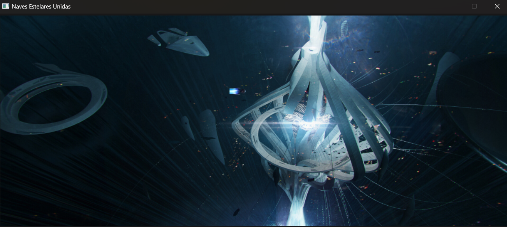
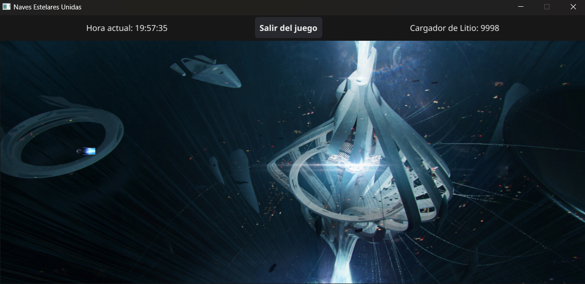

# NavesEstelaresUnidas
**Repository of a estelar game. I hope you enjoy playing this game. ("It's my first game I've created on my whole life") -ry**

## CURRENT GAME VERSION
### 1.1v ALPHA
### Developed by: Mauricio Castillo
### First date of functional version: Tue, September 26th, 2023
### Lastest date of working version: Wed, September 27th, 2023

## Image of the game working

## Updates!
**Adding a new interface where you can find a button to be able to exit to the executable application**

### Features (For developers)
**Basic git-hub command lines to initialize a remote repository pointing to the local one.**
Link your local repository to your GitHub repository:
`git remote add origin <URL_FROM_REPOSITORY>`

**Change 'main' to the name of your main branch if different**
`git branch -M main`
`git add <DOCUMENTS_TO_LAUNCH>`
`git commit -m "message"`
`git push -u origin <MAIN_BRANCH>`

**To initialize a local repository**
`git init`

**To verify what branch you are**
`git branch`

**To create a new branch**
`git branch <NEW_BRANCH_NAME>`

**To switch to another branch**
`git checkout <BRANCH_TO_GO>`

**To delete a branch**
`git branch -d <BRANCH_TO_DELETE>`

**To align a local main branch with the remote main branch on GitHub:**
`git pull origin main --allow-unrelated-histories`

**To verify that remote control "origin" is configured correctly. To be able to list all remote configurated controls and their URLs**
`git remote -v`

**If you want to merge one branch towards your current branch where you are, use this command line**
It's like: you want to merge *(branch2)* towards *(current_branch_where_you_are)*
`git merge <branch2>`
So this command line will do to merge branch2 towards your current branch or position where you are. Be careful when using this command line, especially if you don't have the necessary permissions.
